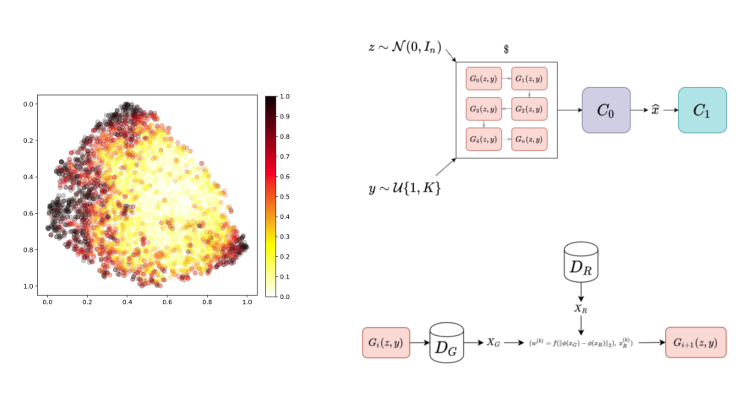

<h1 align="center">
    Boosting Generative Networks for Incremental Learning
</h1>

<b>Training a ResNet classifier using pre-trained BigGAN models</b>

\[[Report](report.pdf)\]

<h1 align="center">
    
</h1>

Using the base implementation of BigGAN provided by Andrew Brock.
Achieves ~88.5% accuracy on `CIFAR-10` (when using data transformations and classifier filtering), versus ~94.3 when trained using real data for the same number of optimization steps. With five GANs, reaches ~91% accuracy.

# Report

Click [HERE](report.pdf) to download the final research report.

# Usage
## Training a classifier

Training a classifier requires:
- pre-trained classifier weights in: `./classifier/weights/model_name.pth`
- pre-trained BigGAN weights in: `./weights/weights_folder_name/`

To run the script:

`python3 train_classifier.py [options]`

Parameters are as follows:

**Input/Output**
- `model`: Weights file to use for the GAN (of the form: `./weights/model_name/G_ema.pth` if single GAN, `./weights/model_name/gan_multi_n/G_ema.pth` if `n` GANs are used)
- `classifier_model`: Weights file to use for the filtering classifier (of the form: ./classifiers/weights/class_model_name.pth)
- `ofile`: Output file name (default: `trained_net`)

**Training**
- `batch_size`: Size of each batch (same for generation/filtering/training, default: 64)
- `num_batches`: Number of batches per class to train the classifier with (default: 1)
- `epochs`: Number of epochs to train the classifier for (default: 10)

**Classifier filtering**
- `filter_samples`: Enable classifier-filtering of generated images (default: `False`)
- `threshold`: Threshold probability for classifier filtering (default: `0.9`)

**Multi-GANs**
- `multi_gans`: Sample using multiple GANs (default: `None`, integer value)
- `gan_weights`: If using multi-GANs, specify weights for each GAN (default: sample from each GAN with equiprobability)

**Other**
- `truncate`: Sample latent z from a truncated normal (default: no truncation, float format).
- `fixed_dset`: Use a fixed generated dataset for training (of size: `batch_size*num_batches*num_classes`, default: `False`)
- `transform`: Apply image transformations to generated images (default: `False`)

## Sampling from GAN weights

To sample from GAN weights:

`python3 sample.py [options]`

Parameters are as follows:

**Input/Output**
- `model`: Same as above
- `ofile`: Output file name (default: `trained_net`)
- `torch_format`: Save NPZ images as float tensors instead of `uint8` (default: `False`)

**Generation**
- `num_samples`: Number of samples to generate (default: 10)
- `class`: Class to sample from (in `[[0,K-1]]` for `K` classes, default: sample sequentially `num_samples/k` for all classes.)
- `random_k`: Sample classes randomly (default: `False`)
- `multi_gans`: Generate samples using multiple GANs (default: `None`, integer value)

**Other**
- `transform`, `truncate`: Same as above

# Scripts
Some bash scripts are already in the folder `./scripts/`, to run classifier training sessions with various parameters.

# References
1. [Brock et al., 2018] Andrew Brock, Jeff Donahue, and
Karen Simonyan. Large scale GAN training for high fidelity
natural image synthesis, 2018.

2. [Pham et al., 2019] Thanh Dat Pham, Anuvabh Dutt, Denis Pellerin, and Georges Quénot. Classifier Training
from a Generative Model. In CBMI 2019 - 17th International Conference on Content-Based Multimedia Indexing,
Dublin, Ireland, September 2019.
